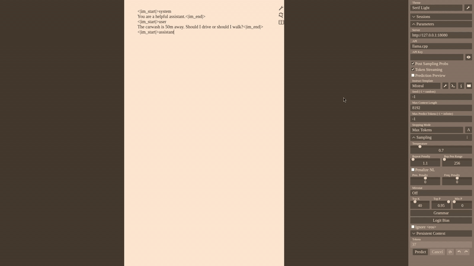

# NLA llama.cpp inference

> [!WARNING]
> This repo is codex slop

> [!TIP]
> The slop might be useful. Please give feedback.

Local prototype for running Natural Language Autoencoder inference with patched `llama.cpp` servers.



Features a built-in extended [Mikupad](https://github.com/lmg-anon/mikupad) UI for NLA.

## Model roles

Full roundtrip uses three models:

1. **Base / target model**
   - extracts original target activations
   - endpoint: `POST /extract`

2. **Actor / AV model**
   - activation vector → natural-language explanation
   - endpoint: `POST /explain`

3. **Critic / AR model**
   - explanation → reconstructed activation
   - endpoints: `POST /reconstruct`, `POST /score`, `POST /edit-direction`

## Default local ports

```text
18080  base server
18082  actor server
18084  critic server
3001   Mikupad UI
```

## Added llama-server endpoints

### `/extract`

Run on the base/target model.

```json
{
  "prompt": [151644, 872, 198],
  "layer": 20,
  "token_pos": -1,
  "add_special": false
}
```

Returns activation metadata and `activation: [3584 floats]`.

### `/explain`

Run on the actor model.

```json
{
  "activation": [3584 floats],
  "input_ids": [actor prompt token ids],
  "inject_pos": 111,
  "scale": 150,
  "n_predict": 200
}
```

Returns generated text and parsed explanation.

### `/reconstruct`

Run on the critic model.

```json
{
  "explanation": "..."
}
```

Returns reconstruction metadata and `activation: [3584 floats]`.

### `/score`

Run on the critic model.

```json
{
  "explanation": "...",
  "activation": [original extracted activation]
}
```

Returns MSE/cosine plus reconstruction metadata.

### `/edit-direction`

Run on the critic model.

```json
{
  "original_explanation": "...",
  "edited_explanation": "..."
}
```

Returns `direction = AR(edited_explanation) - AR(original_explanation)` plus norms/metadata.

### Steered `/completion`

Run on the base model. Normal `/completion` accepts optional token-level NLA steering:

```json
{
  "prompt": "...",
  "n_predict": 128,
  "steering": [
    {
      "token_pos": 123,
      "layer": 20,
      "alpha": 1.0,
      "direction": [3584 floats]
    }
  ]
}
```

At that prompt token/layer, the server applies:

```text
h ← h + alpha * ||h|| * direction / ||direction||
```

## Create GGUFs

GGUF files are generated locally from Hugging Face safetensors repos; they are not committed.

Sources:

```text
base:   https://huggingface.co/Qwen/Qwen2.5-7B-Instruct
actor:  https://huggingface.co/kitft/nla-qwen2.5-7b-L20-av
critic: https://huggingface.co/kitft/nla-qwen2.5-7b-L20-ar
```

Download HF repos:

```bash
uv run --with huggingface_hub huggingface-cli download Qwen/Qwen2.5-7B-Instruct \
  --local-dir hf/base --local-dir-use-symlinks False

uv run --with huggingface_hub huggingface-cli download kitft/nla-qwen2.5-7b-L20-av \
  --local-dir hf/actor --local-dir-use-symlinks False

uv run --with huggingface_hub huggingface-cli download kitft/nla-qwen2.5-7b-L20-ar \
  --local-dir hf/critic --local-dir-use-symlinks False
```

Convert:

```bash
mkdir -p models

uv run --with numpy --with sentencepiece --with pyyaml --with safetensors --with transformers \
  python convert_hf_to_gguf.py hf/base \
  --outfile models/base-q8_0.gguf \
  --outtype q8_0

uv run --with numpy --with sentencepiece --with pyyaml --with safetensors --with transformers \
  python convert_hf_to_gguf.py hf/actor \
  --outfile models/actor-q8_0.gguf \
  --outtype q8_0

uv run --with numpy --with sentencepiece --with pyyaml --with safetensors --with transformers \
  python convert_hf_to_gguf.py hf/critic \
  --outfile models/critic-nla-q8_0.gguf \
  --outtype q8_0
```

The patched converter packages critic metadata and `value_head.safetensors` into the critic GGUF as `nla.*` metadata/tensors.

## Build llama.cpp

From this directory:

```bash
cmake -B build -DGGML_CUDA=ON -DCMAKE_BUILD_TYPE=Release
cmake --build build --config Release -j$(nproc) --target llama-server
```

For CPU-only builds, omit `-DGGML_CUDA=ON`.

## Start services

`frontend/index.html` expects these ports:

```text
18080  base server (`/completion`, `/extract`, steered `/completion`)
18082  actor server (`/explain`)
18084  critic server (`/reconstruct`, `/score`, `/edit-direction`)
```

Run one `llama-server` per role:

```bash
# base server
build/bin/llama-server \
  -m models/base-q8_0.gguf \
  -ngl 99 \
  -c 2048 \
  --port 18080 \
  --host 127.0.0.1

# actor server
build/bin/llama-server \
  -m models/actor-q8_0.gguf \
  -ngl 99 \
  -c 512 \
  --port 18082 \
  --host 127.0.0.1 \
  --cache-ram 0

# critic server
build/bin/llama-server \
  -m models/critic-nla-q8_0.gguf \
  -ngl 0 \
  -c 512 \
  -np 1 \
  --port 18084 \
  --host 127.0.0.1 \
  --cache-ram 0
```

Serve the frontend on port 3001:

```bash
python3 -m http.server 3001 --directory frontend
```

Then open:

```text
http://127.0.0.1:3001/
```

## Frontend

UI flow:

```text
hover token → Explain / NLA → /extract → /explain → modal
modal Score reconstruction button → /score
```

## Important files

```text
convert_hf_to_gguf.py                    patched converter
frontend/index.html                      frontend
examples/extract-layer/                  activation extraction CLI
examples/nla-generate/                   actor injection/generation CLI
```
